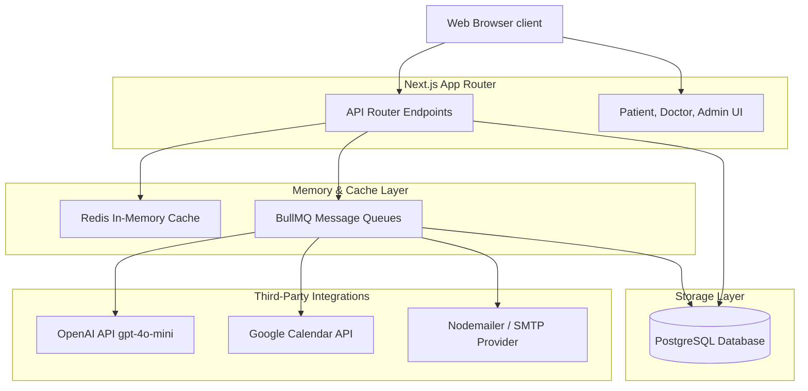

# System Architecture & Design Specification

This document details the system design, concurrency control mechanics, fail-safe procedures, and background queue strategies for the HealthAlign Appointment and Consultation Platform.

---

## 1. High-Level Architecture

The system utilizes Next.js App Router for frontend portals and API handler endpoints. PostgreSQL manages the clinical transactional records, Redis handles concurrency locks and job state storage, and BullMQ processes long-running asynchronous tasks.

---

## 2. Concurrency & Slot Hold Strategy

To prevent race conditions where multiple patients attempt to book the exact same slot concurrently, the booking engine utilizes a two-phase check-and-lock isolation flow:

### Phase 1: Temporary Lock (Redis TTL Hold)
* When a patient selects a doctor and slot date/time, the client requests a lock at `POST /api/slots/hold`.
* The server performs a transaction block:
  1. Checks if the slot is already booked in PostgreSQL.
  2. Checks if a hold key `slot_hold:{doctorId}:{dateTimeISO}` exists in Redis.
  3. If free, sets the key in Redis containing the patient's ID and timestamp.
  4. Configures a Time-to-Live (TTL) of **5 to 10 minutes**.
* The patient has this time window to finalize booking options.

### Phase 2: Booking Transaction (PostgreSQL Isolation)
* When the booking is submitted (`POST /api/slots/book`):
  1. The server enters a `prisma.$transaction` block.
  2. Verifies the Postgres database does not already contain a conflicting appointment record.
  3. Verifies that the Redis hold exists and belongs to the requesting patient.
  4. Writes the appointment record to the database with a `status = 'BOOKED'`.
  5. The transaction commits.
  6. The hold key is deleted from Redis, freeing or resolving the lock.

---

## 3. Doctor Leave Conflict Resolution

When an administrator updates a doctor's profile to add leave dates, the system triggers a cascade cancellation workflow:

1. **Transaction Query**: The system scans for appointments matching the selected doctor that have statuses of `BOOKED` or `SCHEDULED` on the added leave days.
2. **Bulk Status Transition**: Inside `prisma.$transaction`, these appointments are atomically marked as `CANCELLED_BY_DOCTOR`.
3. **Queue Notification**: The endpoint adds job payloads to the `email-queue` to alert the patient of the cancellation and provide a direct re-booking link.
4. **Calendar Removal**: A job is queued on `calendar-queue` to delete the Google Calendar event associated with the appointment using the stored `googleEventId`.

---

## 4. LLM Fail-Safe Architecture

The AI translation and summarization engine is structured to avoid blocking user checkout screens and prevent application failure during API outages:

* **Execution Timeout (8 seconds)**: Every LLM call is wrapped in a `Promise.race` against an 8-second timeout promise.
* **Deterministic Fallback**: If the API call times out, fails, or is missing credentials:
  * The summarization service catches the error.
  * Resolves a default fallback object with `isFallback: true`.
  * For pre-visit: Urgency is set to `"ROUTINE"` and chiefComplaint is truncated from raw text.
  * For post-visit: Friendly summary is set to standard checkup details.
* **Non-blocking Status Header**: The API route handler returns an `x-ai-status: "FALLBACK"` header with HTTP status 200/201, ensuring user execution flows continue uninterrupted.

---

## 5. Background Worker & Retry Strategy

Asynchronous processing is managed using BullMQ workers.

* **Decoupled Task Queues**:
  * `email-queue`: Manages all booking, cancellation, summary, and reminder emails.
  * `calendar-queue`: Manages Google Calendar event creation, updates, and deletions.
* **Exponential Backoff**: Configured with 3 attempts. When a worker fails due to external API throttling, it delays retry using:
  $$\text{Delay} = \text{Base Delay} \times 2^{\text{Attempt}}$$
  Starting at a base delay of 5 seconds (5s, 10s, 20s).
* **Mock Failbacks**: If Redis is not configured in local development environments, a background task simulator runs queue functions inline using `setTimeout`, enabling testing without setting up external dependencies.
